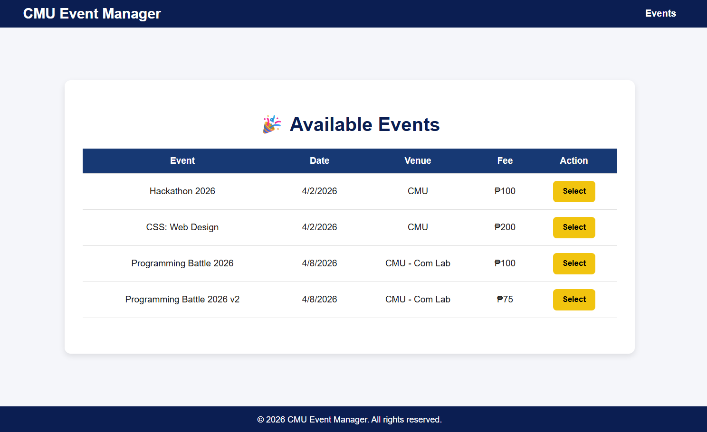
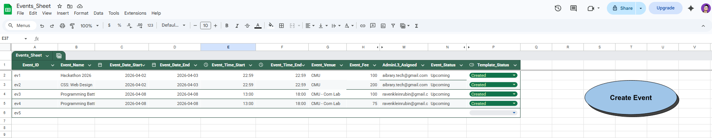
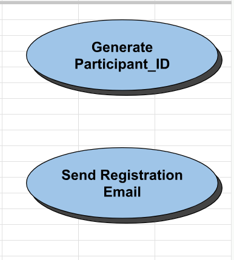
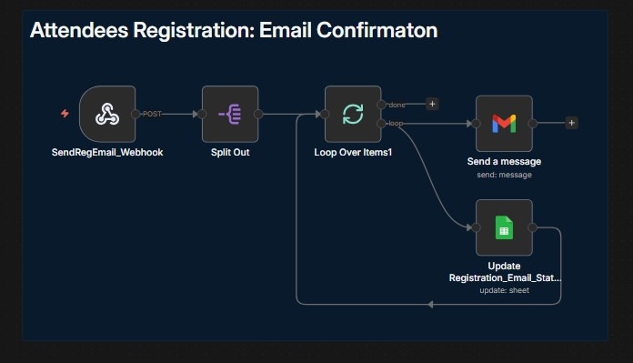
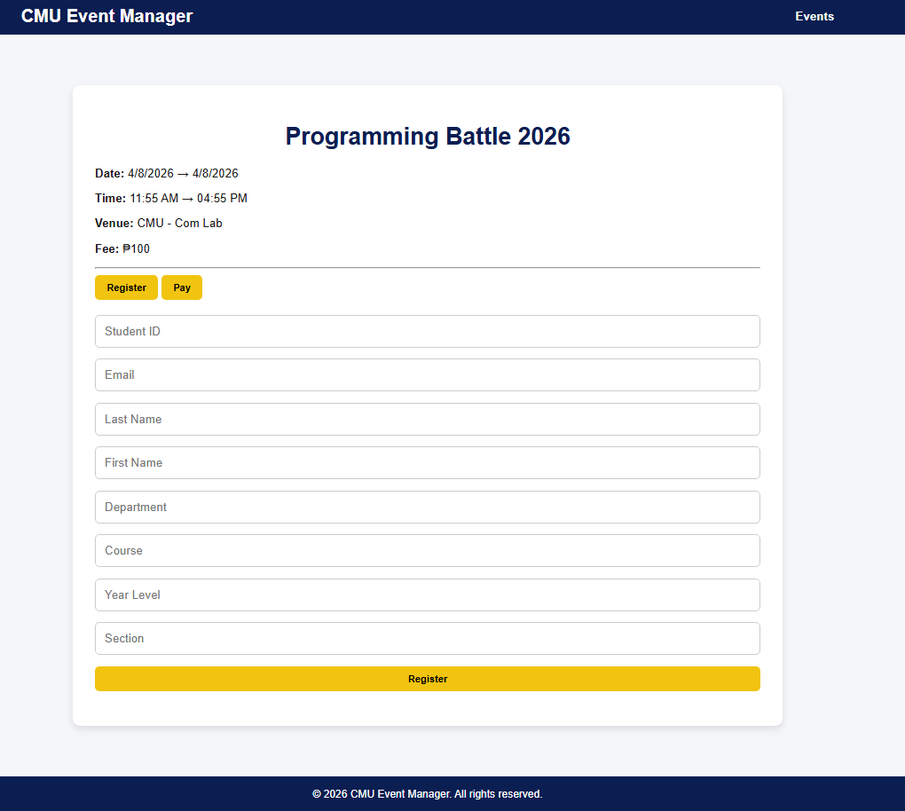
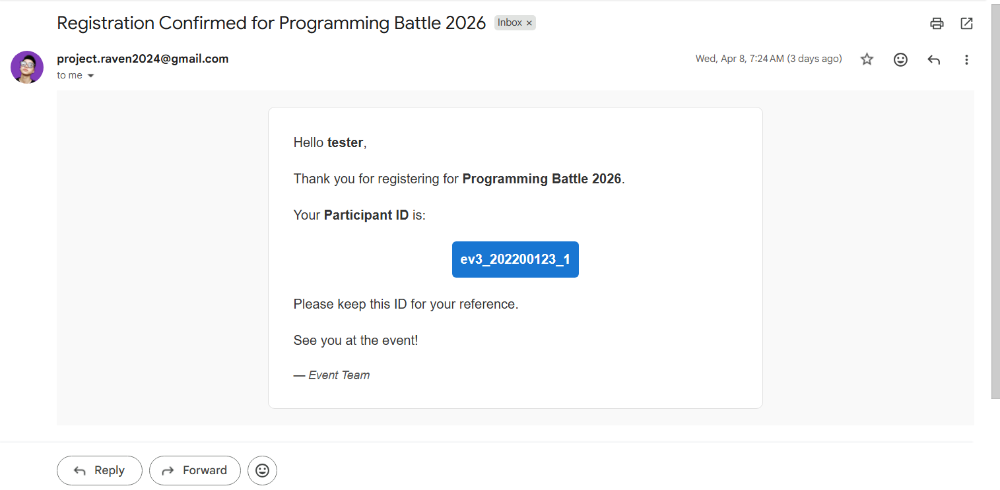
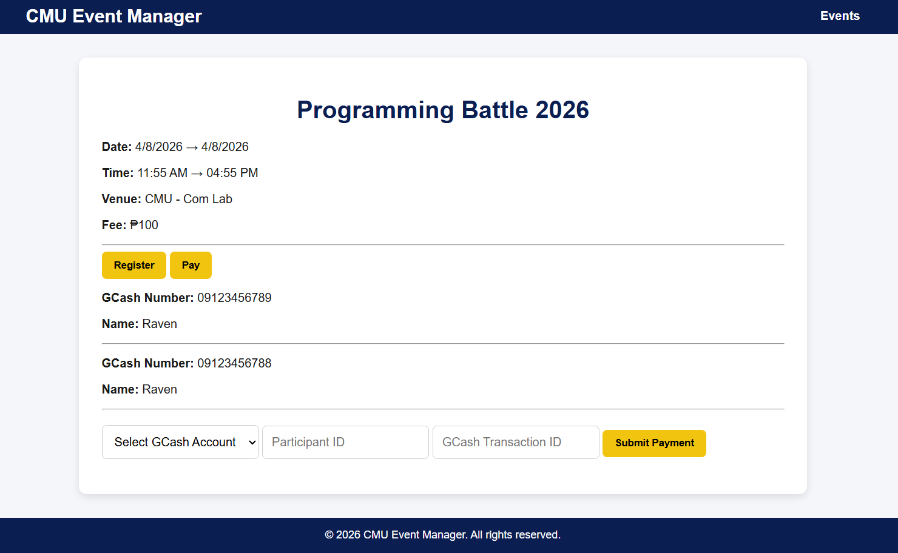
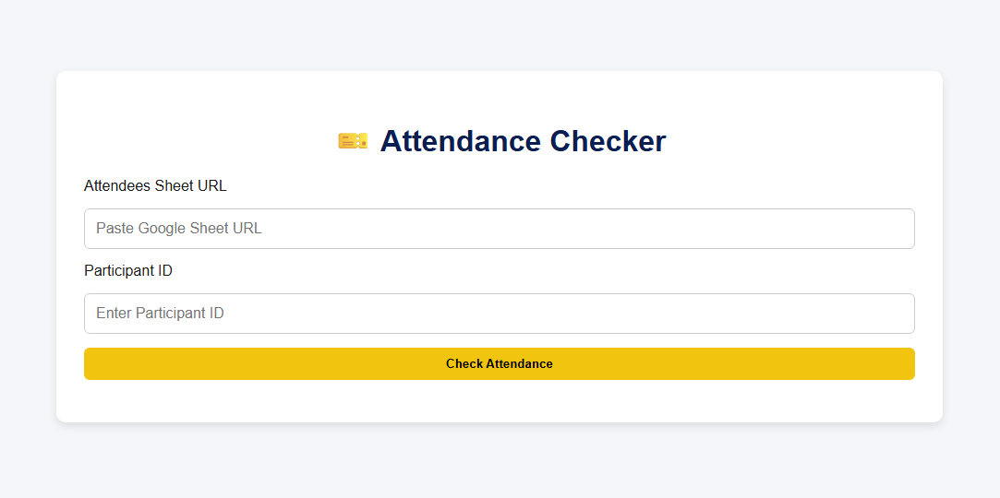

# 🧩 EventSync  
### A System Integration Architecture for Automated Event Workflows

  

  <em>System Overview: Event Creation • Registration • Payment • Attendance Validation</em>

---

## 🚀 Overview

This project is a **System Integration Architecture (SIA)** designed to solve a real operational problem: fragmented event management workflows.

Instead of building a monolithic system from scratch, this solution **connects, automates, and orchestrates existing tools** into a unified, event-driven system.

> 💡 Core Principle:  
> **“Connect, automate, and orchestrate — instead of rebuild.”**

---

  

  <em>Event-Driven System Flow: From Registration to Attendance Validation</em>

  Note: This system flow diagram is AI-generated for visualization purposes.

---

## 🧠 Problem Context (Business-Level)

Most small organizations, schools, and event organizers operate using disconnected tools:

- Registration via forms or chat  
- Attendee tracking in spreadsheets  
- Manual email confirmations  
- Payment instructions sent manually  

### ❌ Root Problem  
The issue is **not lack of tools** — it is the **lack of integration between them**.

### ⚠️ Operational Impact

- Broken workflows across systems  
- Repetitive manual processes  
- Data inconsistencies and duplication  
- Poor attendee experience  

---

## 💡 Solution: Integration-First System Design

This project introduces a **cohesive system architecture** that:

- Integrates multiple tools into a single workflow  
- Automates event-driven processes  
- Maintains a **single source of truth**  
- Eliminates manual coordination between systems  

> ✅ The system does not replace tools — it **connects and orchestrates them**

---

## 🏗️ System Architecture

This system follows an **event-driven integration model**, where each action triggers automated workflows across layers.

### 🔄 High-Level Flow

1. Event is created → stored in the system  
2. Attendee submits registration  
3. System validates and processes input  
4. Orchestration engine triggers workflows:
   - Sends confirmation email  
   - Generates Participant ID  
   - Injects dynamic payment instructions  
5. Payment is verified → system updates status  
6. Attendance is validated in real-time using system data  

---

## ⚙️ Architecture Layers & Rationale

---

### 🧩 1. Data Layer — Google Sheets

  

**Role:** Centralized data layer (Single Source of Truth)

**Manages:**
- Events  
- Attendees  
- Payments  
- System state tracking  

**Why this exists:**

Google Sheets was chosen as the data layer because it is already the primary tool used by event managers.

- Real-time collaborative database behavior
- Aligns with current tools already used in event operations  
- No backend infrastructure required  
- Accessible to non-technical users  
- Fast iteration and deployment  

> 📌 Lightweight data layer enabling rapid system development

---

### 🔧 2. Logic & API Layer — Google Apps Script

  

**Role:** Serverless backend / middleware layer

**Handles:**
- Data validation and processing  
- Participant ID generation  
- Event creation logic  
- API-like system interactions  

**Why this exists:**
- Bridges frontend input and automation layer  
- Eliminates need for traditional backend systems  
- Enables structured business logic inside the ecosystem  

> 📌 Middleware layer enabling business logic execution without infrastructure overhead

---

### 🔁 3. Orchestration Layer — n8n (Core Engine)

  

**Role:** Central workflow orchestration engine

> ⚠️ Not just automation — this is the **system brain**

**Handles:**
- Event-driven workflows  
- Email confirmation pipelines  
- Payment instruction automation  
- Cross-system coordination  

**Why this exists:**
- Decouples system logic from data layer  
- Enables scalable workflow design  
- Centralizes system behavior control  

> 📌 Orchestration layer connecting all system components into one automated flow

---

### 🌐 4. Input Layer — Lightweight Interface

  

**Role:** User interaction layer

**Handles:**
- Event creation  
- Attendee registration  
- Payment submission  
- Attendance validation  

**Design Philosophy:**
- Functional over aesthetic complexity  
- Optimized for usability and speed  

> 📌 Minimal interface designed for efficient system input

---

---

## 🔐 Access Control & Role-Based System Design

This system implements a **multi-level administrative architecture**:

| Level | Role | Responsibility |
|------|------|----------------|
| Level 4 | Master Admin | System-wide control, event creation, data management |
| Level 3 | Event Manager | Manages specific events and attendees |
| Level 2 | Finance/Admin | Payment verification and configuration |
| Level 1 | Gatekeeper | Attendance validation during events |

### 🎯 Why this matters

- Prevents unauthorized system changes  
- Mirrors real-world organizational workflows  
- Enables delegation of responsibilities  
- Supports scalable operations  

---

## 🆔 Participant Identity Management

  

- Unique Participant IDs are auto-generated  
- Serves as system-wide identifier  
- Used for registration, payment, and attendance tracking  

---

## 💳 Payment Processing Flow

  

- Payment instructions dynamically configured per event  
- Attendees submit proof of payment  
- Admin verifies transactions  
- System updates payment status in real-time  

> 💡 Enables structured financial tracking without external payment systems

---

## 🎟️ Real-Time Attendance Validation

  

- Participant ID is verified  
- Payment status is checked  
- Access granted if both conditions are valid  

> 📌 Rule-based validation system powered by live system data

---

## ⚙️ Key Features (MVP)

- Event creation system  
- Automated registration flow  
- Email confirmation with Participant ID  
- Dynamic payment configuration  
- Payment verification workflow  
- Real-time attendance validation  

---

## 📈 Business Value

- Reduces manual workload  
- Centralizes fragmented data  
- Automates repetitive workflows  
- Improves attendee experience  
- Enables scalable event operations  

---

## 🧠 Architecture Decisions

- **Google Sheets** → adopted instead of database for real-world usability  
- **n8n** → used as orchestration engine, not simple automation  
- **Event-driven design** → reduces manual coordination and errors  

---

## 🏁 Conclusion

EventSync demonstrates how real systems can be built by **integrating existing tools into a unified architecture**, rather than building everything from scratch.

> Built with a **system architecture mindset**, focused on integration, automation, and real-world usability.
