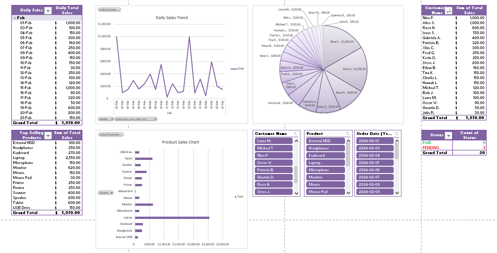

# 📊 Sales Performance Dashboard

## 📌 Overview
- **Goal:** Develop an interactive Excel dashboard to analyze sales trends, identify top-selling products, and track key customer contributions.
- **Tools Used:** Microsoft Excel (Pivot Tables, Pivot Charts, Slicers)
- **Dataset:** Custom-created e-commerce sales dataset

## 🔍 Key Insights
- 🔹 **Monthly Sales Trends:** Identified peak sales days and low-performing periods.
- 🔹 **Top-Selling Products:** Determined the best-performing products based on revenue.
- 🔹 **Top Customers:** Highlighted high-value customers contributing most to sales.
- 🔹 **Dynamic Filters:** Enabled interactive data exploration through slicers (Year, Product, Customer).

## 📊 Project Files
- **Dataset:** `sales_dashboard.xlsx` (sales_dashboard.xlsx)
- **Dashboard:** [View Dashboard](sales_dashboard.xlsx)

## 🚀 Future Improvements
- 🔹 Enhance dashboard with conditional formatting for better trend visualization.
- 🔹 Integrate external data sources for more comprehensive analysis.
- 🔹 Automate data refresh for real-time updates.

---
This project simulates a real-world Data Analyst task, demonstrating how to extract meaningful insights from raw sales data using Excel's analytical capabilities.

