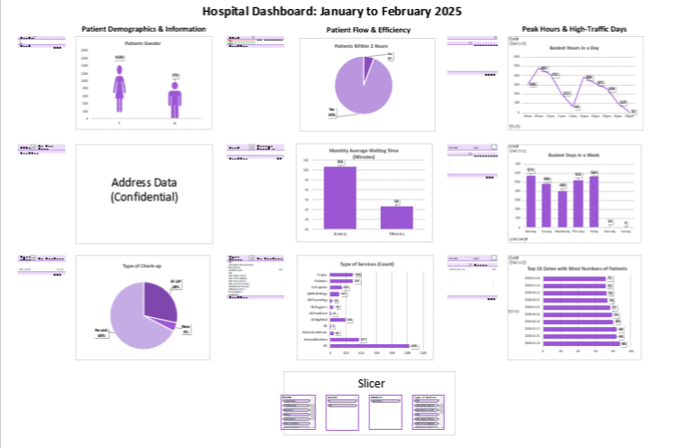

# 🏥 Hospital Data Dashboard

## 📌 Overview
🔹 This is my first Excel dashboard project for a client, focusing on hospital patient data analysis.
- **Goal:** Develop an interactive Excel dashboard to track patient flow, busiest hours, and key hospital metrics.
- **Tools Used:** Microsoft Excel (Pivot Tables, Pivot Charts, Slicers)
- **Dataset:** Modified hospital dataset with confidential data removed

## 🔍 Key Insights
- 🔹 **Patient Flow Analysis:** Identified peak patient hours and busiest days.
- 🔹 **Service Breakdown:** Analyzed types of services provided and check-up categories.
- 🔹 **Demographics Overview:** Examined patient distribution by gender and address.
- 🔹 **Waiting Time Metrics:** Evaluated average waiting times per month.

## 📊 Project Files
- **Dataset:** [Download Modified Dataset](Public_Hospital_Dataset-JAN-FEB-2025 3.csv)
- **Dashboard:** [Download Dashboard](Public_Dashboard_Hospital-JAN-FEB-2025 3.xlsx)

## 🚀 Future Improvements
- 🔹 Refine dashboard layout for better readability and data visualization.
- 🔹 Implement more advanced Excel features for deeper insights.
- 🔹 Automate data cleaning to handle inconsistencies more efficiently.

---
This project provided valuable experience in **data cleaning, structuring insights, and dashboard design**, simulating real-world Data Analyst tasks in the healthcare industry.

