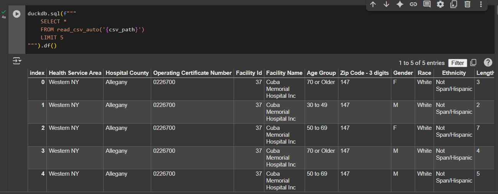
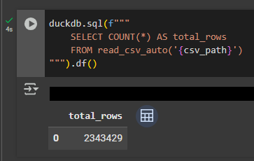

# SPARCS - Hospital 2-Million Dataset

## 📌 Project Overview

This project explores the **New York Statewide Planning and Research Cooperative System (SPARCS)** dataset, containing over **2 million hospital inpatient discharge records**.

The goal of this project is to demonstrate the use of **SQL queries** for analyzing large-scale healthcare data, focusing on patient demographics, insurance distribution, hospital efficiency, and department-level insights.

## ⚙️ Tools & Environment

* **Google Colab**: Used because the dataset is too large to process on a local machine. Running queries in Colab provides better scalability and ensures reproducibility.
* **DuckDB:** Chosen because it fits seamlessly with the Python environment of Google Colab, allowing efficient SQL queries directly on large datasets without needing a full database server.
* **Pandas**: For additional data manipulation.

## 📊 Key Analyses

* Hospital Efficiency KPIs
* Revenue & Cost Insights
* Patient Demographic Patterns

## 📂 Dataset

**New York State Department of Health – SPARCS Hospital Inpatient Discharges (De-Identified)**.

🔗 Dataset Link (800+MB): https://health.data.ny.gov/d/gnzp-ekau  
(Clicking the link will trigger an error, copy it then paste it to your browser)

## 🚀 How to Access the Project

You can explore the project directly in **Google Colab**:  
👉 [Open in Google Colab](https://colab.research.google.com/drive/16vVF4Mv9EUjtuC9yZyd9nt5WzNINmcNA?usp=sharing) 

## 📌 Notes

* The project is focused on **SQL query applications** for healthcare data analysis.
* Visualizations and dashboards are not the primary focus; instead, the emphasis is on extracting insights through queries.

