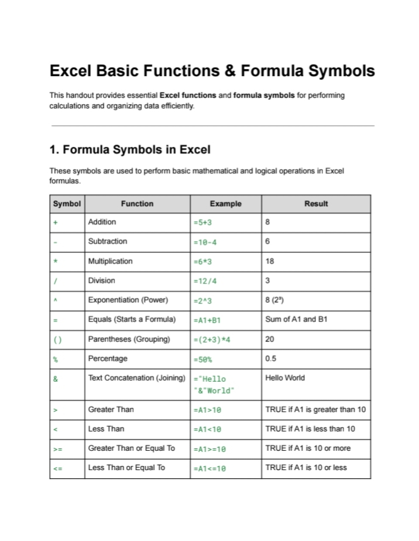

# Excel Formula and Symbols Cheat Sheet

This PDF handout is designed to help beginners and professionals alike understand and quickly reference commonly used Excel formulas and symbols.

## What's Inside?

✔️ Overview of Common Excel Formula Symbols (`+`, `-`, `*`, `/`, `=`, `&`, `<>`, etc.)  
✔️ Guide to Basic Excel Functions (`SUM()`, `AVERAGE()`, `IF()`, `VLOOKUP()`, `ROUND()`, and more)  
✔️ Real-world Examples for Arithmetic, Logic, Text, Date/Time, Lookup, and Math  
✔️ Tips for Using Excel Formulas Effectively  
✔️ Quick Reference for Students, Analysts, and Professionals

---

## Who is this for?

- New Excel users who need a quick-start reference  
- Students and professionals learning Excel formulas and functions
- Self-learners looking to reinforce their understanding of functions
- Anyone who wants to work smarter with formulas

---

## Preview

  

---

## Download

[Download the PDF here](https://github.com/Raven-D3v/data-analytics-portfolio/blob/fba720e2bf0bbf72fc2b0f8ae81f4cd8da7d4a48/Resources/Excel-Handout-Apr2025/Excel_Basic_Functions_%26_Formula_Symbols_Apr2025_Project_Raven_%26.pdf)

---

## Author

Created by RavenKlein T. Rubin – Aspiring Data Analyst & Freelancer  
Feel free to connect with me on [LinkedIn](https://www.linkedin.com/in/raven-klein-r-8705222b6?utm_source=share&utm_campaign=share_via&utm_content=profile&utm_medium=android_app) or check out more projects in this repo!

---

## License

This resource is free to use for educational purposes. Attribution is appreciated but not required.
